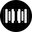
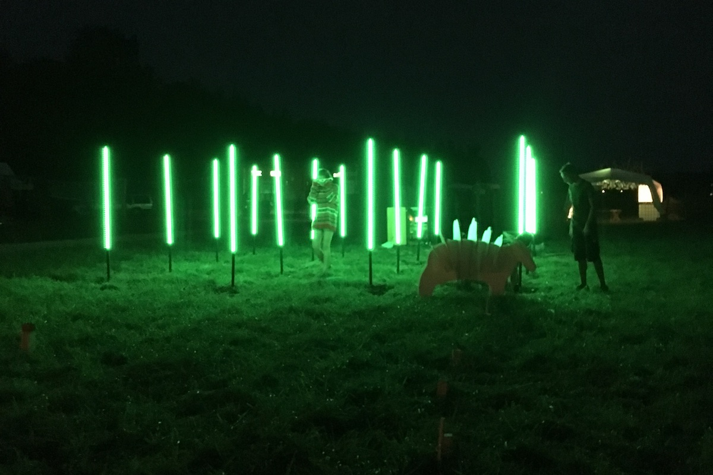
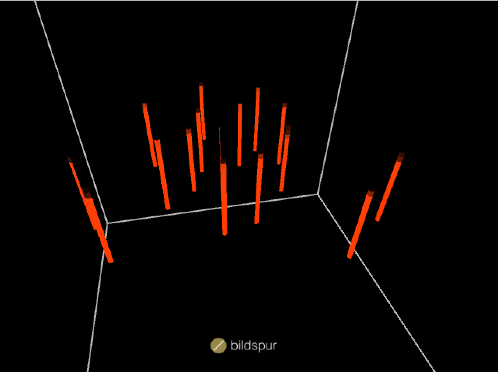
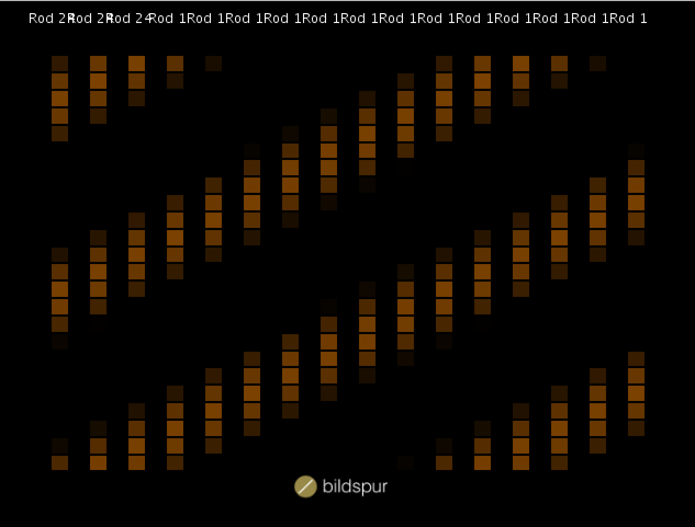
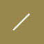

# LED Forest 2
Version 2 of the LED light installation which looks like a forest.



## Technology

* **Processing** is used as underlying framework for all the 3d and 2d graphics
* **Leapmotion** is used for user input
* **Syphon** is used for 2d output (e.g. for MadMapper)
* **Artnet** is used to send data out to dmx devices
* **OSC** is used for remote control and information sharing
* **jmDNS** is used for network discovery
* **Yoctopuce** is used for native sensor capturing

## Instruction
The application can be configured by the `config.json` in the `config` directory. It contains following sections:

```json
{
   "editor":{ .. },
   "syphon":{ .. },
   "osc":{ .. },
   "rods":[ .. ],
   "dmx":{ .. }
}
```

### Fullscreen

To run the application in fullscreen you have to start it with a command line parameter.

```bash
java -jar LEDForest2.jar -fullscreen 0
```

## Example


*LED Forest at the [Kleinlaut Festival](http://www.kleinlautfestival.ch/)*

## User Interface

*3D View*


*2D View (Syphon Output)*


*Rod Edit View*


## About
Developed by [Bildspur](https://bildspur.ch) 2016

